<div align="center">


**A quiet corner of the internet for stories worth telling.**

# 
[](https://www.djangoproject.com/)
[](https://www.django-rest-framework.org/)
[](https://djoser.readthedocs.io/)
[](https://django-rest-framework-simplejwt.readthedocs.io/)
[](https://docs.celeryq.dev/)
[](https://redis.io/)
[](https://react.dev/)
[](https://www.typescriptlang.org/)
[](https://vitejs.dev/)
[](https://tailwindcss.com/)
[](https://tanstack.com/query)
[](https://github.com/pmndrs/zustand)

[**Live Demo**](#) &nbsp;·&nbsp; [Report a Bug](#) &nbsp;·&nbsp; [Request a Feature](#)

</div>


## Table of Contents

- [Overview](#overview)
- [Screenshots](#screenshots)
- [Key Features](#key-features)
- [Tech Stack](#tech-stack)
- [Architecture & Design Decisions](#architecture--design-decisions)
- [Project Structure](#project-structure)
- [Getting Started](#getting-started)
  - [Backend Setup](#backend-setup)
  - [Frontend Setup](#frontend-setup)
- [Environment Variables](#environment-variables)
- [API Overview](#api-overview)
- [Roadmap](#roadmap)
- [Acknowledgments](#acknowledgments)
- [License](#license)

---

## Overview

StoryHub is a full-stack blogging platform with a modern social layer built on top of it. At its core it's a place to write and read long-form stories — but instead of stopping there, it layers in the mechanics people expect from a social feed: following writers, liking and threading comments, bookmarking stories for later, and a real-time-ish notification system that keeps everyone in the loop.

It's built for writers and readers who want a calmer, more deliberate alternative to noisy social feeds — a space designed around reading and writing first, with just enough social interaction to make it feel alive.

The project is split into two independently deployable pieces: a **Django REST Framework** API and a **React + TypeScript** single-page application that consumes it.

## Screenshots


| Home (Light) | Home (Dark) |
|---|---|
| 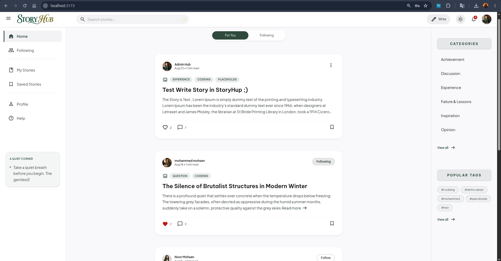 | 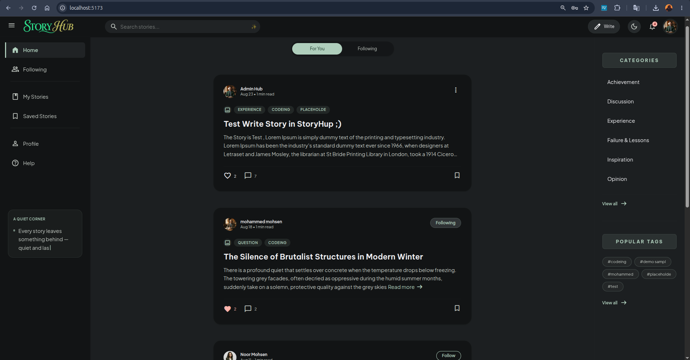 |

| Story Detail | comments & Replies |
|---|---|
| 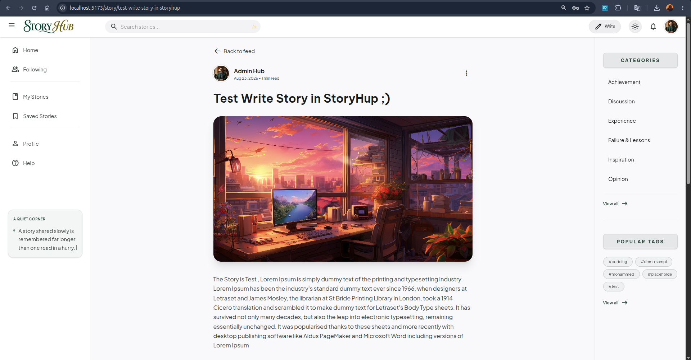 | 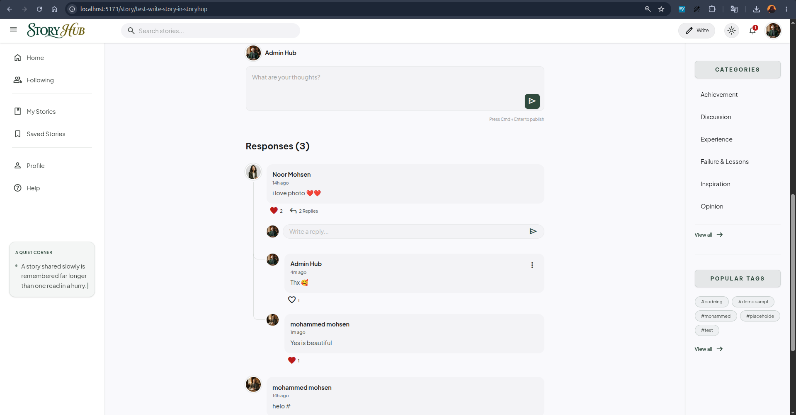 |

| Story Write | Editor |
|---|---|
| 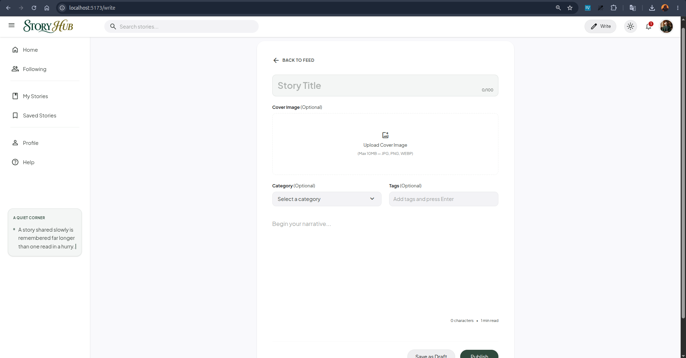 | 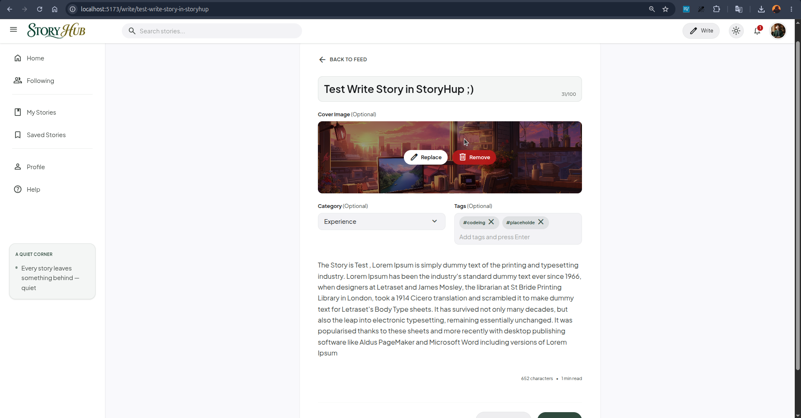 |

| Private Profile | Public Profile |
|---|---|
| 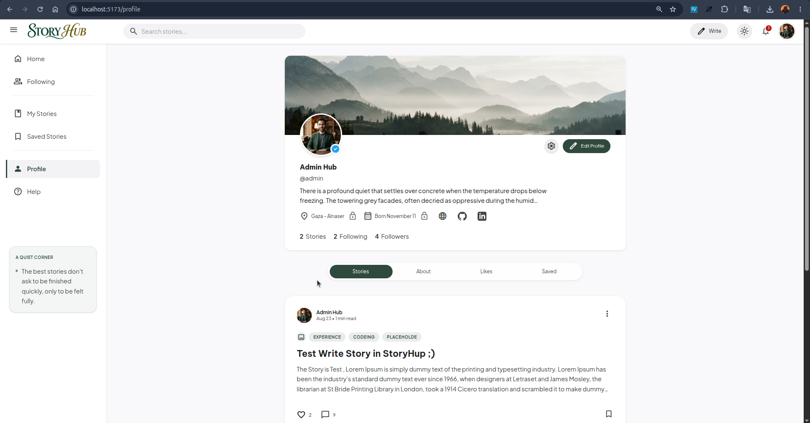 | 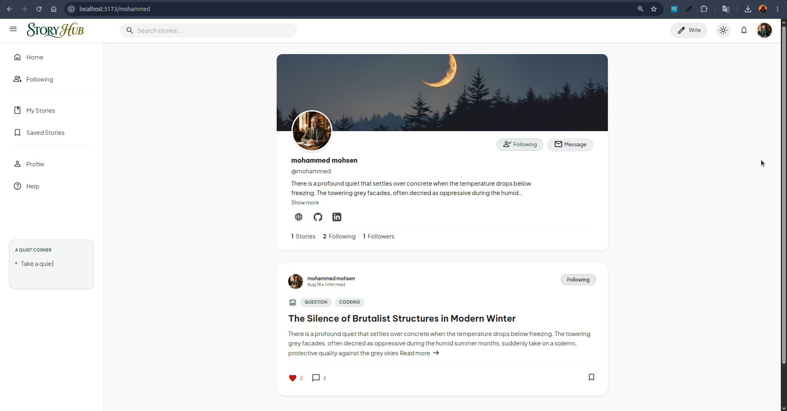 |

| Settings | Notifications |
|---|---|
| 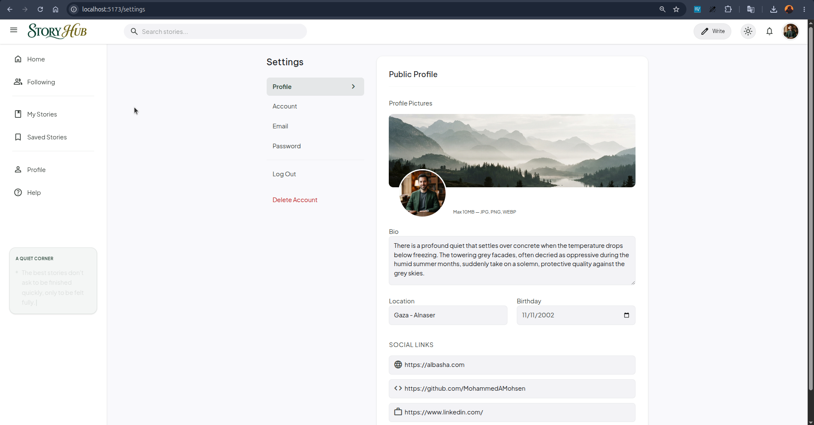 | 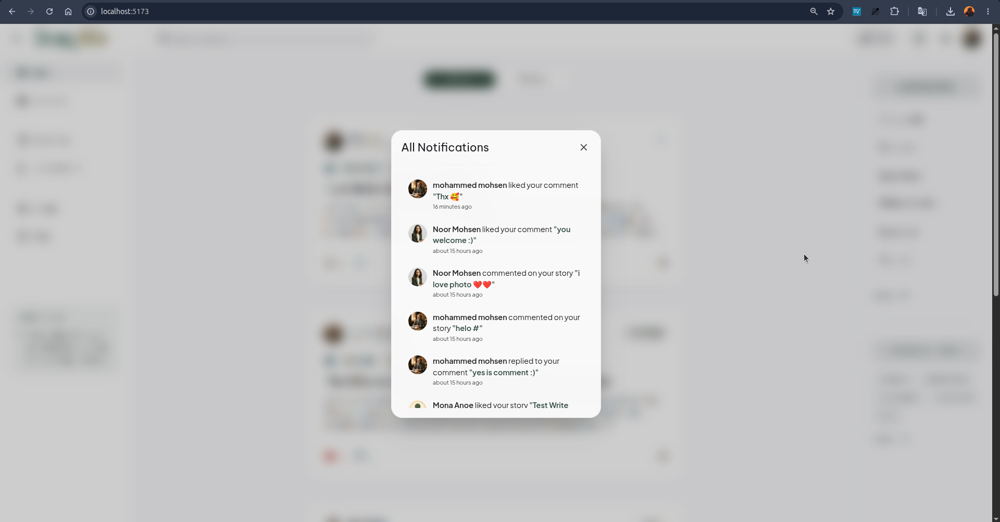 |

| Login / Auth | Mobile View |
|---|---|
| 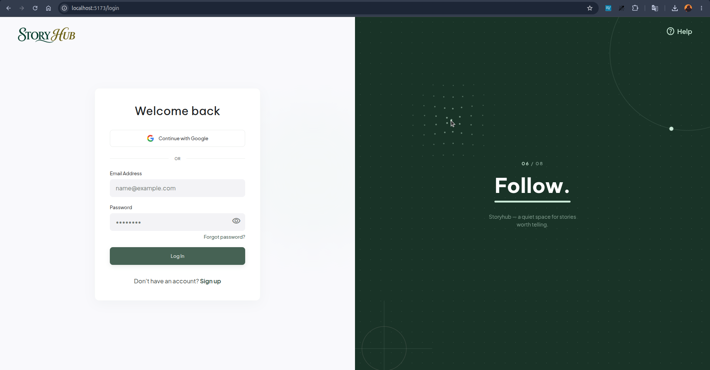 | 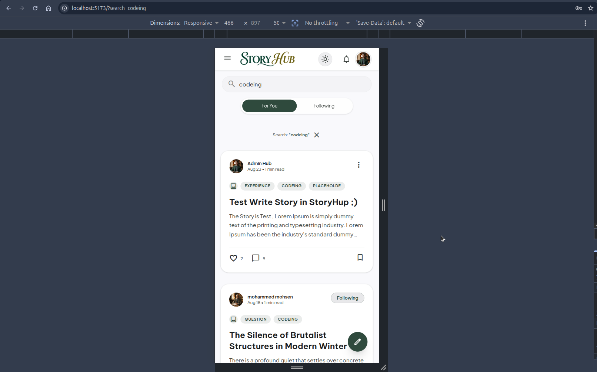 |

## Key Features

### Authentication
- Email/password registration with mandatory email activation (Djoser + Celery-sent emails)
- JWT-based login (access + refresh tokens, automatic silent refresh, refresh-token blacklisting on logout)
- **Google OAuth** sign-in/sign-up (Google Identity Services on the frontend, server-side ID token verification on the backend)
- Forgot password / reset password flow via emailed, single-use tokens
- Dynamic password management that adapts to how the user signed up — a Google-only user (no usable password) gets a "Set Password" flow, while a regular user gets a "Change Password" flow that requires their current password
- Change-email flow with a confirmation link sent to the *new* address before the change takes effect
- Route guards in both directions: unauthenticated users are redirected away from protected pages, and already-authenticated users are redirected away from the login/sign-up/reset pages

### Stories
- Draft → Published → Archived workflow, plus permanent deletion
- Cover image upload with client- and server-side validation (size, format)
- Categories and free-form tags (tags are created on the fly and reused across stories), both browsable through dedicated "view all" modals
- Full-text search across title, content, author name, category, and tags
- Filtering by category and tag, ordering by recency

### Social Interactions
- Follow / unfollow writers, with a dedicated "Following" feed
- Like stories and comments
- Bookmark ("Save") stories for later, with a paginated saved-stories page
- Threaded comments: top-level comments plus one level of replies, each independently paginated
- Collapsible comment threads with an animated, precisely-measured connector line between a comment and its replies

### Real-time-ish Updates
- Optimistic UI updates across the entire app for likes, bookmarks, and follows — the UI reacts instantly and rolls back only if the request actually fails
- A single story's state (like count, bookmark state, etc.) stays in sync everywhere it appears on screen at once — the story feed, an author's profile, the bookmarks page, the story detail view — without each page needing to know about the others
- Notification system with periodic polling (every 15 seconds) plus refetch-on-focus, unread badge count, and deep links that jump straight to the relevant story or comment

### Profile & Settings
- Separate private (own) and public (visitor-facing) profile views
- Tabbed profile layout with floating followers/following lists
- Full Settings hub: Profile (avatar, cover, bio, links), Account (name, username), Email, Password, and Danger Zone (account deletion) — each section saves independently
- Editable public profile fields: bio, location, birthday, and social links (website, GitHub, LinkedIn)

### Design System
- A custom design-token system ("Luminous Prose") built entirely on CSS variables rather than Tailwind's default palette, so every color automatically has a light and dark counterpart
- Full dark/light theme toggle with the preference persisted and respected on load (falls back to the OS preference on first visit)
- Fully responsive, mobile-first layout with a collapsible sidebar and a dedicated mobile search overlay
- Accordion-style Help Center with instant, client-side search across all Q&A entries

## Tech Stack

### Backend

| Technology | Version | Role |
|---|---|---|
| Django | 6.0.7 | Core web framework |
| Django REST Framework | 3.17.1 | REST API layer |
| Djoser | 2.3.3 | Authentication endpoints (register, activate, password reset, etc.) |
| djangorestframework-simplejwt | 5.5.1 | JWT issuing, refresh, and blacklisting |
| google-auth | 2.56.3 | Verifying Google OAuth ID tokens server-side |
| Celery | 5.6.3 | Asynchronous email sending |
| Redis | — | Celery broker/result backend and Django's cache backend |
| django-redis | 7.0.0 | Redis cache integration |
| django-cors-headers | 4.9.0 | CORS handling for the separate frontend origin |
| django-filter | 26.1 | Declarative query filtering (category, tags, etc.) |
| drf-spectacular | 0.30.0 | OpenAPI schema generation (`schema.yml` / Swagger UI) |
| django-cleanup | 9.0.0 | Automatically deletes orphaned media files (old avatars/covers) on change |
| django-silk | 5.5.0 | Request/query profiling during development |
| django-extensions | 4.1 | Development quality-of-life tooling |
| Pillow | 12.3.0 | Image processing for uploaded avatars/covers |
| pytest, factory_boy, Faker | — | Test suite tooling |
| SQLite | — | Default development database |

### Frontend

| Technology | Version | Role |
|---|---|---|
| React | 19.2 | UI library |
| TypeScript | ~6.0 | Static typing across the entire app |
| Vite | 8 | Dev server and build tool |
| React Router | 7.18 | Client-side routing and route guards |
| TanStack Query (React Query) | 5.101 | Server state, caching, pagination, optimistic updates |
| Zustand | 5.0 | Lightweight client state (auth, theme, UI, local story overrides) |
| Axios | 1.19 | HTTP client with an interceptor-based token refresh flow |
| Tailwind CSS | v4.3 | Utility-first styling, driven by CSS-variable design tokens |
| date-fns | 4.4 | Date formatting and relative timestamps |
| Material Symbols | — | Icon system (loaded as a variable web font) |

## Architecture & Design Decisions

**Two separate projects, not a monorepo.** The backend and frontend live and deploy independently, communicating purely over the REST API. This keeps the API a real contract rather than an implicit one, lets either side be redeployed or even rewritten without touching the other, and avoids the tooling overhead of a monorepo for a project this size.

**A single, centralized cache-patching mechanism instead of per-page cache wiring.** Every page that can display a story — the home feed, an author's profile, the bookmarks page, a single story view — is backed by its own React Query cache entry, in its own shape (some are `useInfiniteQuery` pages of results, some wrap the story inside `{ saved_at, story }`, some are the story object directly). Rather than teaching every mutation (like, bookmark, follow, delete) the exact cache keys and shapes it needs to update, `lib/storyCache.ts` exposes `patchStoryEverywhere()`: it walks *every* cache entry currently held by React Query, recognizes a story by its `slug` (or by `username` for author-story lists) wherever it's nested, and patches it in place. A brand-new page added later that renders stories in some new shape gets the synchronized updates automatically, with zero additional wiring.

**Cover image uploads happen in two stages.** Django's `QueryDict` (used to parse `multipart/form-data`) doesn't reliably preserve list fields like `tags` the way JSON does. Sending the whole story payload as `multipart/form-data` whenever a new cover image is attached, and as plain JSON otherwise, means tags are always sent — and parsed — correctly, while image uploads still work when they're actually needed.

**Design tokens over Tailwind's default palette.** Every color in the app (`--color-primary`, `--color-surface`, `--color-on-surface`, etc.) is a CSS custom property defined once for light mode and once for dark mode, with Tailwind's `@theme` layer simply pointing at them. Toggling dark mode is a single class swap on `<html>`; no component needs its own `dark:` variant scattered through its class list.

**All modals render through a React Portal.** `GlassModal` renders into `document.body` via `createPortal` instead of inline in the component tree, so a modal opened from deep inside a scrollable, `overflow-hidden`, or `position: relative` container is never clipped or mis-stacked by an ancestor's styling.

**Polling instead of WebSockets, for now.** Notifications and unread counts are kept fresh with interval polling (every 15 seconds) plus a refetch on window focus, rather than a persistent WebSocket connection. It's simple, needs no extra infrastructure, and is "good enough" for the current scale. The architecture doesn't fight a future move to push-based updates — Django Channels is the natural next step and is called out in the [Roadmap](#roadmap).

**A single top-level Error Boundary.** The whole app is wrapped in one `ErrorBoundary` so a render-time exception anywhere shows a graceful fallback instead of a blank white screen.

## Project Structure

```text
StoryHub/
├── backend/
│   ├── apps/
│   │   ├── accounts/        # Custom user model, profiles, Google OAuth, email/password flows
│   │   ├── stories/         # Stories, categories, tags
│   │   ├── comments/        # Threaded comments and replies
│   │   ├── likes/           # Generic like relation (stories & comments)
│   │   ├── bookmarks/       # Saved stories
│   │   ├── follows/         # Follow relationships
│   │   └── notifications/   # Notification feed and unread count
│   ├── config/               # Settings, URLs, Celery app, WSGI/ASGI
│   ├── manage.py
│   └── requirements.txt
│
└── frontend/
    ├── src/
    │   ├── pages/            # Route-level views (Home, StoryDetail, Write, Settings, Auth pages...)
    │   ├── components/
    │   │   ├── layout/       # Header, Sidebar, RightSidebar, feed tabs
    │   │   ├── story/        # Story card, comment thread, comment composer
    │   │   ├── settings/     # Settings hub sections
    │   │   ├── auth/         # Auth pages' shared layout, route guards, Google button
    │   │   ├── profile/      # Followers modal, brand icons, etc.
    │   │   └── ui/           # Modal, lightbox, theme toggle
    │   ├── hooks/             # React Query hooks per resource (stories, comments, profile...)
    │   ├── store/             # Zustand stores (auth, theme, UI, story overrides)
    │   ├── lib/               # Axios instance, story cache patcher, small utilities
    │   └── types/             # Shared TypeScript types
    └── index.html
```

## Getting Started

### Backend Setup

**Requirements:** Python 3.12+, Redis running locally (for cache + Celery)

```bash
# 1. Clone the repo and enter the backend folder
git clone <repository-url>
cd StoryHub/backend

# 2. Create and activate a virtual environment
python -m venv venv
source venv/bin/activate      # Windows: venv\Scripts\activate

# 3. Install dependencies
pip install -r requirements.txt

# 4. Configure environment variables
cp .env.example .env
# then edit .env — see the Environment Variables section below

# 5. Run migrations
python manage.py migrate

# 6. Create an admin user (optional)
python manage.py createsuperuser

# 7. Start the development server
python manage.py runserver

# 8. In a separate terminal: start Celery (needs Redis running)
celery -A config worker -l info
```

### Frontend Setup

**Requirements:** Node.js 20+ (required by Vite 8)

```bash
# 1. Enter the frontend folder
cd StoryHub/frontend

# 2. Install dependencies
npm install

# 3. Configure environment variables
cp .env.example .env
# then edit .env — see the Environment Variables section below

# 4. Start the dev server
npm run dev
```

The app will be available at `http://localhost:5173`, talking to the API at `http://localhost:8000`.

## Environment Variables

### Backend (`backend/.env`)

| Variable | Description |
|---|---|
| `SECRET_KEY` | Django's cryptographic secret key |
| `DEBUG` | `True` for development, `False` in production |
| `ALLOWED_HOSTS` | Comma-separated list of allowed hostnames |
| `FRONTEND_URL` | The frontend's origin — used to build email links (activation, password reset, email change) |
| `EMAIL_USER` | SMTP username (Gmail address sending transactional emails) |
| `EMAIL_PASS` | SMTP app password |
| `GOOGLE_CLIENT_ID` | OAuth client ID used to verify Google Sign-In tokens |

### Frontend (`frontend/.env`)

| Variable | Description |
|---|---|
| `VITE_API_URL` | Base URL of the backend API (e.g. `http://localhost:8000`) |
| `VITE_GOOGLE_CLIENT_ID` | The **same** Google OAuth client ID as the backend's `GOOGLE_CLIENT_ID` — required for the "Continue with Google" button |

## API Overview

Full interactive documentation is generated by **drf-spectacular** and available via `schema.yml` / Swagger UI once the backend is running. Below are the most commonly used endpoints.

| Method | Endpoint | Description |
|---|---|---|
| `POST` | `/auth/users/` | Register a new account |
| `POST` | `/auth/users/activation/` | Activate an account via the emailed link |
| `POST` | `/auth/jwt/create/` | Log in (obtain access + refresh tokens) |
| `POST` | `/auth/jwt/refresh/` | Refresh an access token |
| `POST` | `/auth/users/logout/` | Log out (blacklists the refresh token) |
| `POST` | `/auth/users/reset_password/` | Request a password-reset email |
| `POST` | `/auth/users/reset_password_confirm/` | Confirm a password reset |
| `POST` | `/api/google/` | Sign in / sign up with a Google ID token |
| `GET` | `/auth/users/me/` | Current authenticated user |
| `GET /PATCH` | `/api/profile/me/` | Get or update the current user's profile |
| `GET` | `/api/profile/{username}/` | Public profile by username |
| `GET /POST` | `/api/stories/` | List published stories / create a new story |
| `GET /PATCH /DELETE` | `/api/stories/{slug}/` | Retrieve, update, or delete a story |
| `GET` | `/api/stories/me/` | The current user's own stories (any status) |
| `GET` | `/api/stories/following/` | Stories from writers the user follows |
| `GET` | `/api/category/` | List all categories (cached for 1 week) |
| `GET` | `/api/tag/` | List all tags |
| `GET /POST` | `/api/comments/?story={slug}` | List top-level comments / post a new comment or reply |
| `GET` | `/api/comments/{id}/replies/` | Paginated replies to a comment |
| `POST` | `/api/like/` | Toggle a like on a story or comment |
| `GET /POST` | `/api/bookmarks/` | List saved stories / toggle a bookmark |
| `POST` | `/api/follows/` | Toggle following a user |
| `GET` | `/api/notifications/` | List notifications (marks the returned page as read) |
| `GET` | `/api/notifications-count/` | Unread notification count |

## Roadmap

- **Django Channels / WebSockets** — replace notification polling with real push-based updates
- **Tag popularity ranking** — the sidebar's "Popular Tags" widget now pulls real tags from the API (`GET /api/tag/`) instead of a hardcoded list, but the endpoint doesn't yet rank them by actual usage — it's every tag, alphabetically. Add a usage-count annotation to make the "Popular" in the name accurate
- **PostgreSQL migration** — some comment-like-count queries currently use a `SerializerMethodField` workaround instead of database-level `Count`/`Exists` annotations, specifically because SQLite doesn't reliably support `GenericRelation` lookups against a UUID primary key; this goes away on Postgres

## Acknowledgments

- **Backend** — designed and built entirely independently, from data modeling to every API endpoint.
- **UI/UX design** — the overall visual design was created with [Google Stitch AI](https://stitch.withgoogle.com/projects/6314632997687598080).
- **Frontend** — the complete React frontend, and connecting it to the Django backend, was built with the assistance of [Claude](https://claude.ai) (Anthropic).

## License

All rights reserved. This project is part of my personal portfolio and is for demonstration purposes only. Unauthorised copying, modification, or distribution is prohibited.
